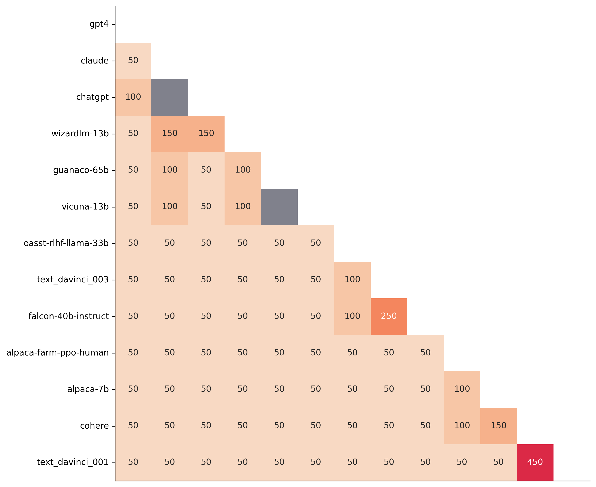

# AlpacaEval : An Automatic Evaluator for <br/>Instruction-following Language Models

[](https://github.com/tatsu-lab/alpaca_farm/blob/main/LICENSE)
[](https://github.com/tatsu-lab/alpaca_farm/blob/main/DATA_LICENSE)
[](https://www.python.org/downloads/release/python-390/)

Evaluation of instruction-following models (e.g., GPT4, ChatGPT) typically requires human interactions. This is
time-consuming, expensive, and hard to replicate. AlpacaEval in an LLM-based automatic evaluation that is fast, cheap,
and replicable.
AlpacaEval provides the following:

- [**Automatic evaluator**](#evaluators): an automatic evaluator that has high agreement with humans. We evaluate a
  model by
  measuring the fraction of times an oracle LLM (e.g. Claude or GPT 4) prefers the outputs from that model over a
  fixed reference model. Our automatic evaluators enable caching and randomization by default, and allow for advanced features such
  as batching or pooling different annotators.
- [**Leaderboard**](#models): a leaderboard of common models on the AlpacaEval evaluation set.
- [**Toolkit for building automatic evaluators**](#analysis): a toolkit for
  building and analyzing automatic evaluators (quality,
  price, speed, statistical power, etc).
- [**Human evaluation data**](#data-release): 20K human preferences between a given and reference model
  on the [AlpacaFarm](https://github.com/tatsu-lab/alpaca_farm/tree/main)
  evaluation set. 2.5K of these are cross-annotations (4 humans annotating the same 650 examples).
- [**AlpacaEval dataset**](#data-release): a simplification of
  the [AlpacaFarm](https://github.com/tatsu-lab/alpaca_farm/tree/main) evaluation set, where "instructions" and "
  inputs" are merged
  into a single field.

<details open>
  <summary><b>Table of Contents</b></b></summary>

1. [Quick Start](#quick-start)
2. [Leaderboard](#leaderboard)
    - [Models](#models)
    - [Evaluators](#evaluators)
3. [Use-cases](#use-cases)
    - [Evaluating a model](#evaluating-a-model)
    - [Making a new leaderboard](#making-a-new-leaderboard)
    - [Making a new evaluator](#making-a-new-evaluator)
4. [Analysis](#analysis)
    - [Analyzing an evaluator](#analyzing-an-evaluator)
    - [Analyzing an eval set](#analyzing-an-eval-set)
5. [Data Release](#data-release)
6. [Differences with AlpacaFarm](#differences-with-alpacafarm)
7. [Citation](#citation)

</details>

## Quick Start

To install the stable release, run

```bash
pip install alpaca-eval
```

To install the nightly version, run

```bash
pip install git+https://github.com/tatsu-lab/alpaca_eval
```

Then you can use it as follows:

```bash
export OPENAI_API_KEY=<your_api_key>
export OPENAI_ORGANIZATION_IDS=<your_organization_id>  # Optional; if not set, this will be your default org id.
alpaca_eval --model_outputs 'example/outputs.json'
```

Important parameters are the following:

- **model_outputs** : A path to a json file for the outputs of the model to add to the leaderboard. Each dictionary should
  contain the keys `instruction`, `output`, and (optionally) `input`.
- **annotators_config**: This is the annotator to use (e.g., `gpt4`, `text-davinci-003`, `claude`). `gpt4` has the highest agreement rate with our human annotation data. For a comparison of
  annotators see [here](#evaluators).
- **reference_outputs**:  The outputs of the reference model. Same format as `model_outputs`. By default, this is `text-davinci0003` outputs on
  AlpacaEval dataset.
- **output_path**: Path for saving annotations and leaderboard.

If you don't have the model outputs, you can use `evaluate_from_model` and pass a local path or a name of a HuggingFace
model, or a model from a standard API (OpenAI, Anthropic, Cohere). Other commands:

<details open>
  <summary><code>>>> alpaca_eval -- --help</code></summary>

```
SYNOPSIS
    alpaca_eval COMMAND

COMMANDS
    COMMAND is one of the following:

     evaluate
       Evaluate a model based on its outputs. This is the default entrypoint if no command is specified.

     evaluate_from_model
       Evaluate a model from HuggingFace or an API provider. This is a wrapper around `evaluate` which includes generating from a desired model.

     make_leaderboard
       Precompute and save an entire leaderboard for a given dataset / evaluator / set of models generations.

     analyze_evaluators
       Analyze an evaluator (agreement with human, speed, price,...).
```

</details>

For more information about each function use `alpaca_eval <command> -- --help`.

## Leaderboard

### Models

Our leaderboards are computed are on the [AlpacaEval dataset](https://huggingface.co/datasets/tatsu-lab/alpaca_eval).
We precomputed the leaderboard for important models both using `gpt4` (best quality) and  `claude` (free for academics,
and high quality). See below for [adding your model](https://github.com/tatsu-lab/alpaca_eval#evaluating-a-model) to the
leaderboard or making
a [new leaderboard for your evaluator/dataset](https://github.com/tatsu-lab/alpaca_eval#making-a-new-leaderboard).

**GPT-4 Leaderboard**:

|                       | Win Rate | Std Err. |
|:----------------------|---------:|---------:|
| gpt4                  |     95.3 |      0.7 |
| claude                |     88.4 |      1.1 |
| chatgpt               |     86.1 |      1.2 |
| wizardlm-13b          |     75.3 |      1.5 |
| guanaco-65b           |     71.8 |      1.6 |
| vicuna-13b            |     70.4 |      1.6 |
| oasst-rlhf-llama-33b  |     66.5 |      1.7 |
| text_davinci_003      |     50.0 |      0.0 |
| falcon-40b-instruct   |     45.7 |      1.8 |
| alpaca-farm-ppo-human |     41.2 |      1.7 |
| alpaca-7b             |     26.5 |      1.5 |
| text_davinci_001      |     15.2 |      1.2 |

<details>
  <summary><b>Claude Leaderboard</b></summary>

|                       | Win Rate | Std Err. |
|:----------------------|---------:|---------:|
| gpt4                  |     77.0 |      1.5 |
| claude                |     75.8 |      1.5 |
| chatgpt               |     67.7 |      1.6 |
| wizardlm-13b          |     66.1 |      1.7 |
| vicuna-13b            |     63.2 |      1.7 |
| guanaco-65b           |     62.6 |      1.7 |
| oasst-rlhf-llama-33b  |     57.3 |      1.7 |
| text_davinci_003      |     50.0 |      0.0 |
| falcon-40b-instruct   |     46.7 |      1.8 |
| alpaca-farm-ppo-human |     46.5 |      1.8 |
| alpaca-7b             |     32.3 |      1.6 |
| text_davinci_001      |     21.5 |      1.4 |

</details>

### Evaluators

We evaluate different automatic annotators on the AlpacaEval set by comparing to
2.5k [human annotation](https://huggingface.co/datasets/tatsu-lab/alpaca_eval/blob/main/alpaca_farm_human_crossannotations.json)
we collected. For details about the evaluation metrics see [here](#analyzing-an-evaluator).

|                         | Human agreement [%] | Price [$/1000 examples] | Time [seconds/1000 examples] | Bias | Variance | Proba. prefer longer |
|:------------------------|--------------------:|------------------------:|-----------------------------:|-----:|---------:|---------------------:|
| alpaca_eval_gpt4        |                69.2 |                    13.6 |                         1455 | 28.4 |     14.6 |                 0.68 |
| aviary_gpt4             |                69.1 |                    12.8 |                         1869 | 29.5 |     13.1 |                 0.70 |
| gpt4                    |                66.9 |                    12.5 |                         1037 | 31.5 |     14.6 |                 0.65 |
| alpaca_farm_greedy_gpt4 |                66.4 |                    15.3 |                          878 | 30.2 |     19.3 |                 0.60 |
| humans                  |                65.7 |                   300.0 |                        36800 |  0.0 |          |                 0.64 |
| claude                  |                65.5 |                    11.1 |                          173 | 31.9 |     18.0 |                 0.62 |
| text_davinci_003        |                64.1 |                     8.7 |                          121 | 33.8 |     22.7 |                 0.70 |
| lmsys_gpt4              |                63.2 |                    13.9 |                        17982 | 34.7 |     16.1 |                 0.74 |
| guanaco_33b             |                59.1 |                         |                          930 | 54.5 |     27.1 |                 0.70 |
| chatgpt                 |                57.2 |                     0.8 |                          285 | 39.4 |     34.1 |                 0.59 |

<details>
  <summary><b>Tips for choosing evaluators</b></summary>

When choosing an annotator we recommend you to (obviously) consider the **quality** / **price** / **time**, but we also
suggest considering the following:

- "Proba. prefer longer " approx. < 0.7. Indeed, we found see that the majority of preference of human annotators (which
  we use
  as gold
  standard) have strong bias for longer answers (as shown by the high quality of the "longest" evaluator that always
  prefers the longest output). This suggests that it might more of a bias with the human annotators. In order to avoid
  having leaderboards with strong biases for length, we suggest using automatic annotators with less than 0.7 "Proba.
  prefer longer".
- "Variance" approx. < 0.2. We believe that a good evaluator should have as little variance as possible so that
  different people get similar results. Note that variance can be desirable in the case where we are simulating humans
  as shown in [AlpacaFarm](https://arxiv.org/abs/2305.14387).

We filtered the rest of the annotators in the table above (besides humans / ChatGPT / 003 for reference purposes), for
all
results see [here](). In general, we found `alpaca_eval` to be a good trade-off between quality / price / time /
variance / length bias.

</details>

## Use-cases

<details>
  <summary><b>Installation from source (optional)</b></b></summary>

1. clone the repository
2. install as dev the package: `pip install -e .`
3. (optional) export
   all [API_KEYs](https://github.com/tatsu-lab/alpaca_eval/blob/main/src/alpaca_eval/constants.py#L7)
4. test your installation (assuming you have OpenAI
   key) `alpaca_eval --model_outputs 'example/eval_gpt_3.5-turbo-0301.json' --annotators_config 'text-davinci-003' --max_instances 3 --caching_path None `

</details>

### Evaluating a model

<details>
  <summary><code>>>> alpaca_eval evaluate -- --help</code></summary>

```
NAME
    alpaca_eval evaluate - Evaluate a model based on its outputs. This is the default entrypoint if no command is specified.

SYNOPSIS
    alpaca_eval evaluate <flags>

DESCRIPTION
    Evaluate a model based on its outputs. This is the default entrypoint if no command is specified.

FLAGS
    --model_outputs=MODEL_OUTPUTS
        Type: Optional[Union]
        Default: None
        The outputs of the model to add to the leaderboard. Accepts data (list of dictionary, pd.dataframe, datasets.Dataset) or a path to read those (json, csv, tsv) or a function to generate those. Each dictionary (or row of dataframe) should contain the keys that are formatted in the prompts. E.g. by default `instruction` and `output` with optional `input`. If None, we just print the leaderboard.
    -r, --reference_outputs=REFERENCE_OUTPUTS
        Type: Union
        Defaul...
        The outputs of the reference model. Same format as `model_outputs`. If None, the reference outputs are the
 003 outputs on the AlpacaEval set.
    --annotators_config=ANNOTATORS_CONFIG
        Type: Union
        Default: 'alpaca_eval_gpt4'
        The path the (or list of dict of) the annotator's config file. For details see the docstring of `PairwiseA
nnotator`.
    -n, --name=NAME
        Type: Optional[Optional]
        Default: None
        The name of the model to add to the leaderboard. If None we check if `generator is in model_outputs` if no
t we use "Current model".
    -o, --output_path=OUTPUT_PATH
        Type: Union
        Default: 'auto'
        Path to the directory where the new leaderboard and the annotations should be stored. If None we don't sav
e. If `auto` we use `model_outputs` if it is a path, and otherwise use the directory from which we call the script
.
    -p, --precomputed_leaderboard=PRECOMPUTED_LEADERBOARD
        Type: Union
        Default: 'auto'
        The precomputed leaderboard or a path to it (json, csv, or tsv). The leaderboard should contain at least t
he column `win_rate`. If `auto` we will try to use the corresponding leaderboard for the reference outputs (only i
f in CORRESPONDING_OUTPUTS_LEADERBOARDS). If `None` we won't add other models from the leaderboard.
    --is_overwrite_leaderboard=IS_OVERWRITE_LEADERBOARD
        Type: bool
        Default: False
        Whether to overwrite the leaderboard if the model is already in it.
    -l, --leaderboard_mode_to_print=LEADERBOARD_MODE_TO_PRINT
        Type: Optional
        Default: 'minimal'
        The mode of the leaderboard to use. Only used if the precomputed leaderboard has a column `mode`, in which
 case it will filter the leaderboard by this mode. If None keeps all.
    -c, --current_leaderboard_mode=CURRENT_LEADERBOARD_MODE
        Type: str
        Default: 'community'
        The mode of the leaderboard for the current method.
    --is_return_instead_of_print=IS_RETURN_INSTEAD_OF_PRINT
        Type: bool
        Default: False
        Whether to return the metrics instead of printing the results.
    -f, --fn_metric=FN_METRIC
        Type: Union
        Default: 'pairwise_to_winrate'
        The function or function name in `metrics.py` that will be used to convert preference to metrics. The func
tion should take a sequence of preferences (0 for draw, 1 for base win, 2 when the model to compare wins) and retu
rn a dictionary of metrics and the key by which to sort the leaderboard.
    -s, --sort_by=SORT_BY
        Type: str
        Default: 'win_rate'
        The key by which to sort the leaderboard.
    --is_cache_leaderboard=IS_CACHE_LEADERBOARD
        Type: Optional
        Default: False
        Whether to save the result leaderboard to `precomputed_leaderboard`. If None we save only if max_instances
. A preferred way of adding models to the leaderboard is to set `precomputed_leaderboard` to the previously saved
leaderboard at `<output_path>/leaderboard.csv`.
    --max_instances=MAX_INSTANCES
        Type: Optional[Optional]
        Default: None
        The maximum number of instances to annotate. Useful for testing.
    --annotation_kwargs=ANNOTATION_KWARGS
        Type: Optional[Optional]
        Default: None
        Additional arguments to pass to `PairwiseAnnotator.annotate_head2head`.
    Additional flags are accepted.
        Additional arguments to pass to `PairwiseAnnotator`.
```

</details>

<details>
  <summary><code>>>> alpaca_eval evaluate_from_model -- --help</code></summary>

```
NAME
    alpaca_eval evaluate_from_model - Evaluate a model from HuggingFace or an API provider. This is a wrapper around `evaluate` which includes generating from a desired model.

SYNOPSIS
    alpaca_eval evaluate_from_model MODEL_CONFIGS <flags>

DESCRIPTION
    Evaluate a model from HuggingFace or an API provider. This is a wrapper around `evaluate` which includes generating from a desired model.

POSITIONAL ARGUMENTS
    MODEL_CONFIGS
        Type: Union
        A dictionary or path (relative to `models_configs`) to a yaml file containing the configuration of the model to decode from. If a directory,we search for 'configs.yaml' in it. The keys in the first dictionary should be the generator's name, and the value should be a dictionary of the generator's configuration which should have the

FLAGS
    -r, --reference_model_configs=REFERENCE_MODEL_CONFIGS
        Type: Optional[Union]
        Default: None
        Same as in `model_configs` but for the reference model. If None, we use the same model as the one we are
    -e, --evaluation_dataset=EVALUATION_DATASET
        Type: Union
        Defaul...
        Path to the evaluation dataset or a function that returns a dataframe. If None, we use the default evaluat
ion
    -a, --annotators_config=ANNOTATORS_CONFIG
        Type: Union
        Default: 'alpaca_eval_gpt4'
        Path to the annotators configuration or a dictionary. If None, we use the default annotators configuration
.
    -o, --output_path=OUTPUT_PATH
        Type: Union
        Default: 'auto'
        Path to save the generations, annotations and leaderboard. If auto saves at `results/<model_name>`
    -m, --max_instances=MAX_INSTANCES
        Type: Optional[int]
        Default: None
        Maximum number of instances to generate and evaluate. If None, we evaluate all instances.
    -i, --is_strip_output=IS_STRIP_OUTPUT
        Type: bool
        Default: True
        Whether to strip trailing and leading whitespaces from the outputs.
    Additional flags are accepted.
        Other kwargs to `evaluate`

NOTES
    You can also use flags syntax for POSITIONAL ARGUMENTS
```

</details>

To evaluate a model you need to:

1. Choose an evaluation set and compute outputs specified as `model_outputs`. By default, we use
   the 805 examples from [AlpacaEval](#data-release). To compute outputs on AlpacaEval use:

```python
import datasets

eval_set = datasets.load_dataset("tatsu-lab/alpaca_eval", "alpaca_eval")["eval"]
for example in eval_set:
    # generate here is a placeholder for your models generations
    example["output"] = generate(example["instruction"])
```

if your model is a HuggingFace model or from a standard API provider (OpenAI, Anthropic, Cohere). Then you can
directly use `alpaca_eval evaluate_from_model` to also take care of generating outputs on the desired data as
discussed below.

2. Compute the reference outputs `reference_outputs`. By default, we use the outputs of `text-davinci-003` on
   AlpacaEval.
   If you
   want to use a different model or a different dataset use the same as (1.).
3. Choose an evaluator specified via `annotators_config`. We recommend using `alpaca_eval_gpt4` or `claude` (if you are
   an
   academic). For options and comparisons see [this table](#evaluators). Depending on the evaluator you might need to
   set the appropriate API_KEY in your environment
   or [here](https://github.com/tatsu-lab/alpaca_eval/blob/main/src/alpaca_eval/constants.py#L7).

Running all together:

```bash
alpaca_eval  --model_outputs 'example/eval_gpt_3.5-turbo-0301.json'\
              --reference_outputs <path> \
             --annotators_config 'alpaca_eval'\
             --max_instances <specify for testing>
```

If you don't have decoded outputs, you can use `evaluate_from_model` which takes care of decoding (model and reference)
for you. Here's an
example:

```bash
# need a GPU for pythia
export ANTHROPIC_API_KEY=<your_api_key> # let's use claude as reference
alpaca_eval evaluate_from_model --model_configs 'oasst_pythia_12b'\
              --reference_model_configs 'claude'\
             --annotators_config 'chatgpt'\
             --max_instances 3
```

Here the `model_configs` and `reference_model_configs` (optional) are paths to a directory that specifies the prompt,
the model
provider (here HuggingFace and Anthropic) and decoding parameters.
See [this directory](https://github.com/tatsu-lab/alpaca_eval/tree/main/src/alpaca_eval/models_configs) for examples.


<details>
  <summary><b>Information about annotators</b></b></summary>

- **Caching**: by default all annotations are cached on
  disk at `caching_path`. Annotations are thus never recomputed, which makes annotations faster, cheaper and allow for
  reproducibility. This helps even when evalauting different models as many models
  have
  the same outputs.
- **Output randomization** by default, we randomize over the examples of outputs, as we found that annotators tend to
  prefer the first examples
  they see.
- **Batching** we provide code and examples to batch annotations, which decreases cost and time for annotations if the
  prompt is long. See for
  example [alpaca_farm_greedy_gpt4](https://github.com/tatsu-lab/alpaca_eval/tree/main/src/alpaca_eval/evaluators_configs/alpaca_farm_greedy_gpt4).
- **Pool of annotators** we provide code and examples to evaluate using a pool of automatic annotators, which is helpful
  for replicating the variance of [human annotations](https://arxiv.org/abs/2305.14387). See for
  example [alpaca_farm](https://github.com/tatsu-lab/alpaca_eval/tree/main/src/alpaca_eval/evaluators_configs/alpaca_farm).
- **Seeding based on instructions** For reproducibility and more fair comparison between models, we seed all
  randomness (output order, order in batches,
  examples for each annotator in a pool) based on the instruction.

</details>

### Making a new leaderboard

<details>
  <summary><code>>>> alpaca_eval make_leaderboard -- --help</code></summary>

```
NAME
    alpaca_eval make_leaderboard - Precompute and save an entire leaderboard for a given dataset / evaluator / set of models generations.

SYNOPSIS
    alpaca_eval make_leaderboard LEADERBOARD_PATH <flags>

DESCRIPTION
    Precompute and save an entire leaderboard for a given dataset / evaluator / set of models generations.

POSITIONAL ARGUMENTS
    LEADERBOARD_PATH
        Type: Union
        The path to save the leaderboard to. The leaderboard will be saved as a csv file, if it already exists it will

FLAGS
    --annotators_config=ANNOTATORS_CONFIG
        Type: Union
        Default: 'alpaca_eval_gpt4'
        The path the (or list of dict of) the annotator's config file.
    --all_model_outputs=ALL_MODEL_OUTPUTS
        Type: Union
        Default: <fu...
        The outputs of all models to add to the leaderboard. Accepts data (list of dictionary, pd.dataframe, datas
ets.Dataset) or a path to read those (json, csv, tsv potentially with globbing) or a function to generate those. I
f the path contains a globbing pattern, we will read all files matching the pattern and concatenate them. Each dic
tionary (or row of dataframe) should contain the keys that are formatted in the prompts. E.g. by default `instruct
ion` and `output` with optional `input`. It should also contain a column `generator` with the name of the current
model.
    -r, --reference_outputs=REFERENCE_OUTPUTS
        Type: Union
        Defaul...
        The outputs of the reference model. Same format as `all_model_outputs` but without needing `generator`. By
 default, the reference outputs are the 003 outputs on AlpacaEval set.
    -f, --fn_add_to_leaderboard=FN_ADD_TO_LEADERBOARD
        Type: Callable
        Default: 'evaluate'
        The function to use to add a model to the leaderboard. If a string, it should be the name of a function in
 `main.py`. The function should take the arguments: `model_outputs`, `annotators_config`, `name`, `precomputed_lea
derboard`, `is_return_instead_of_print`, `reference_outputs`.
    -i, --is_return_instead_of_print=IS_RETURN_INSTEAD_OF_PRINT
        Type: bool
        Default: False
        Whether to return the metrics instead of printing the results.
    Additional flags are accepted.
        Additional arguments to pass to `fn_add_to_leaderboard`.

NOTES
    You can also use flags syntax for POSITIONAL ARGUMENTS
```

</details>


If you want to make a new leaderboard in one go (rather than multiple `alpaca_eval` calls), for your desired evaluation
set and evaluators, you can use the following:

```bash
alpaca_eval make_leaderboard --leaderboard_path <path_to_save_leaderboard>\
                             --all_model_outputs <model_outputs_path>\
                             --reference_outputs <reference_outputs_path>\
                              --annotators_config <path_to_config.yaml>
```

where:

- `leaderboard_path`: path to save the leaderboard to. The leaderboard will be saved as a csv file, if it already exists
  it will append.
- `all_model_outputs` : The json path to outputs of all models to add to the leaderboard. Each dictionary should contain
  the keys that are formatted in the prompts. E.g. by default `instruction` and `output` with optional `input`. It
  should also contain a column `generator` with the name of the current model.
- `reference_outputs` the path to the outputs of the reference model. Same format as `all_model_outputs` but without
  needing `generator`. By
  default, the reference outputs are the 003 outputs on AlpacaEval set.
- `annotators_config`: The path to the annotator's config file. Defaults to `gpt4`.

### Making a new evaluator

<details>
  <summary><code>>>> alpaca_eval analyze_evaluators -- --help</code></summary>

```
NAME
    alpaca_eval analyze_evaluators - Analyze an evaluator (agreement with human, speed, price,...).

SYNOPSIS
    alpaca_eval analyze_evaluators <flags>

DESCRIPTION
    Analyze an evaluator (agreement with human, speed, price,...).

FLAGS
    --annotators_config=ANNOTATORS_CONFIG
        Type: Union
        Default: 'alpaca_eval_gpt4'
        The path the (or list of dict of) the annotator's config file.
    -A, --Annotator=ANNOTATOR
        Default: <class 'alpaca_eval.annotators.pairwise_evaluator.PairwiseAn...
        The annotator class to use.
    --analyzer_kwargs=ANALYZER_KWARGS
        Type: Optional[]
        Default: None
        Additional arguments to pass to the analyzer.
    -p, --precomputed_leaderboard=PRECOMPUTED_LEADERBOARD
        Type: Union
        Default: PosixPath('/Users/yanndubois/Desktop/GitHub/alpaca_eval/src/...
        The precomputed (meta)leaderboard of annotators or a path to it (json, csv, or tsv).
    --is_save_leaderboard=IS_SAVE_LEADERBOARD
        Type: bool
        Default: False
        Whether to save the leaderboard (ie analyzed results).
    --is_return_instead_of_print=IS_RETURN_INSTEAD_OF_PRINT
        Type: bool
        Default: False
        Whether to return the leaderboard (ie analyzed results). If True, it will not print the results.
    --is_overwrite_leaderboard=IS_OVERWRITE_LEADERBOARD
        Type: bool
        Default: False
        Whether to overwrite the leaderboard if it already exists.
    -m, --max_instances=MAX_INSTANCES
        Type: Optional[Optional]
        Default: None
        The maximum number of instances to analyze.
    --is_single_annotator=IS_SINGLE_ANNOTATOR
        Type: bool
        Default: False
        Whether to analyze a single annotator. If True, will not be able to estimate the annotator's bias.
```

</details>

AlpacaEval provides a simple way to make a new evaluator. All you need is to make a new `configs.yaml` configuration
file, which you will then pass
as `--annotators_config <path_to_config.yaml>` to `alpaca_eval`.
Here are some ways you can make a new evaluator:

- **Changing the prompt**: Write a new prompt in a text file and specify the path in `prompt_template` of the
  configuration file. Paths are relative to the configuration file.
- **Changing decoding parameters**: Specify the desired parameters in `completions_kwargs` in the configuration file. To
  see all available parameters refer to the docstring corresponding
  function [in this file](https://github.com/tatsu-lab/alpaca_eval/blob/main/src/alpaca_eval/decoders/__init__.py)
  specified by `fn_completions`
  in the configuration file.
- **Changing the model**: Specify the desired model in `model_name` in the configuration file. You will likely have to
  change the prompt as `prompt_template` to match that model. If the model comes from another provider you will also
  have
  to change the `fn_completions` in the configuration file which maps to the corresponding function
  in [this file](https://github.com/tatsu-lab/alpaca_eval/blob/main/src/alpaca_eval/decoders/__init__.py). We
  provide `fn_completions` functions to use any model on OpenAI API, Anthropic API, Cohere API, or HuggingFace hub. If
  you change provider you will need to install there API and set the appropriate API_KEY. To install all
  use `pip install alpaca_eval[all]`.

[//]: # (- **Using multiple annotators**: Specify a list of annotators in `annotators_config` in the configuration file. For an)

[//]: # (  example)

[//]: # (  see [alpaca_farm configuration]&#40;https://github.com/tatsu-lab/alpaca_eval/blob/main/src/alpaca_eval/evaluators_configs/alpaca_farm/configs.yaml&#41;.)

<details>
  <summary><b>Other parameters in the configuration file</b></b></summary>

The easiest is to check the docstrings
of [`SinglePairwiseAnnotator`](https://github.com/tatsu-lab/alpaca_eval/blob/main/src/alpaca_eval/annotators/pairwise_evaluator.py#L537).
Here are some important ones:

```
Parameters
----------
prompt_template : path
    A prompt that will be given to `fn_prompter` or path to the prompts. Path is relative to
    `evaluators_configs/`

fn_completion_parser : callable or str
    Function in `completion_parsers.py` to use for parsing the completions into preferences. For each completion,
    the number of preferences should be equal to the batch_size if not we set all the preferences in that batch to
    NaN.

completion_parser_kwargs : dict
    Kwargs for fn_completion_parser.

fn_completions : callable or str
    Function in `decoders.py` to use for decoding the output.

completions_kwargs : dict
    kwargs for fn_completions. E.g. model_name, max_tokens, temperature, top_p, top_k, stop_seq.

is_randomize_output_order : bool
    Whether to randomize output_1, output_2 when formatting.

batch_size : int
    Number of examples that will be added in a single prompt.
```

</details>

Once you made the evaluator you can also analyze it and add it to the _evaluator's_ [leaderboard](#evaluators) using the
following command:

```bash
alpaca_eval analyze_evaluators --annotators_config '<path_to_config.yaml>'    
```

Note that this will evaluate 4 times (different seeds) every example in the AlpacaFarm evaluation set, i.e., ~3K
evaluation.
Be mindful of the cost of this operation depending on your model.
If you want a less expensive evaluation you can use a single seed using `--is_single_annotator True`.

# Analysis

AlpacaEval provides a few analysis tools to help you automatic evaluation. We briefly explain them here and provide
notebooks for all analysis.

### Analyzing an evaluator

**Analyzing evaluators:**
[](https://colab.research.google.com/github/tatsu-lab/alpaca_eval/blob/main/notebooks/analyzing_annotators.ipynb)

The most important factors when selecting an evaluator are the quality, price, and speed. The following plot shows how
the different evaluators compare on these factors.


Here we see that `alpaca_eval_gpt4` performs very well and is better than humans on all the considered metrics.
Once we decided on which automatic annotator to use, a natural
question is whether making a leaderboard using our
automatic annotator gives similar results as a leaderboard from humans. As part of AlpacaEval, we provide human
annotations of outputs from 22 methods annotated on our eval set => 22*805 = ~18K annotations. As a result we can test
the correlation of any automatic annotation with human annotations.


<p float="left" align="middle">

</p>

We see that the leaderboard from `alpaca_eval_gpt4` is highly correlated to the leaderboard from humans, which further
suggests that automatic evaluation is a good proxy for human evaluation.

For the code and more analysis such as bias vs variance tradeoff of annotators,
see [this notebook](https://github.com/tatsu-lab/alpaca_eval/blob/main/notebooks/analyzing_annotators.ipynb), or the
colab notebook above.

### Analyzing an eval set

**Making evaluation sets:**
[](https://colab.research.google.com/github/tatsu-lab/alpaca_eval/blob/main/notebooks/analyzing_evalset.ipynb)

When creating an evaluation set there are usually two main factors to consider: how much data to use? and what data?

One way of answering the first question is by considering a leaderboard of models that you believe are of different
quality and then checking how many examples are needed to distinguish between them in a statistically significant way (
using pairwise t-test). We show this in the following plot for all the pairs in the minimal `claude` leaderboard.

[//]: # (![plot_paired_ttest_nsamples.png]&#40;figures%2Fplot_paired_ttest_nsamples.png&#41;)

<p float="left" align="middle">

</p>

This shows that many pairs can already be distinguished with as few as 50 examples, but going up to 450 allows to
distinguish many other models. This suggests that we could likely decrease the evaluation set size by a factor of nearly
2 in case 800 annotations are too expensive.

The second question is what data to use. Again we can try to answer this question from a statistical power perspective:
what data allows to best distinguish between models. Let's consider this for all the datasets that are part of
AlpacaEval, but let us control for the size of the evaluation sets as we only care about the quality of the data. The
following plot shows the p-values from the relative t-tests of each pairs of models on 80 examples of each datasets.


We see for example that the self-instruct dataset yields the least statistical power. This is likely because the
questions are too simple for current models, and suggests that one could remove this dataset from the evaluation set.

For the code and more analysis of the evaluation set,
see [this notebook](https://github.com/tatsu-lab/alpaca_eval/blob/main/notebooks/analyzing_evalset.ipynb), or the
colab notebook above.

# Data release

As part of AlpacaEval, we release the following data:

- **Human annotations (17K)** in order to develop and understand automatic evaluators, we release all the human pairwise
  evaluation that we collected for AlpacaFarm. This contains comparisons between 18 models with the `text-davinci-003`
  reference on the AlpacaFarm evaluation set. Annotations are from a pool of 16 crowdworkers on Amazon Mechanical Turk.
- **Human cross-annotations (3K)** in order to further analyze automatic evaluators we selected (via stratified sampling
  across models and datasets) 650 examples from the AlpacaFarm evaluation set and collected 4 human annotations per
  example. This allows us to estimate the bias and variance of automatic evaluators.
- **AlpacaEval set (800)** we made slight modifications/simplification of the AlpacaFarm evaluation set. In particular,
  we first merged
  the instruction and input fields into a single instruction field. This affects 1/4 of the examples in the AlpacaFarm
  evaluation set, all of which are from the [self-instruct evaluation set](https://arxiv.org/abs/2212.10560). Second we
  regenerated the text-davinci-003 reference outputs without limiting the length of its outputs.

## Differences with AlpacaFarm

AlpacaEval is an improvement and simplification of the automatic pairwise preference simulator 
from [AlpacaFarm](https://github.com/tatsu-lab/alpaca_farm). 
Outside of AlpacaFarm, you should be using AlpacaEval. 
Here are the main differences:

- **AlpacaEval merges instructions and inputs**: The AlpacaEval evaluation is the same as the AlpacaFarm evaluation
  except that the instruction and input fields are merged as `{instruction}\n\n{input}`. This affects 1/4 of the
  examples in the AlpacaFarm evaluation set (the [self-instruct](https://arxiv.org/abs/2212.10560) subset).
  This simplification provides a more fair comparison for models that were not trained by distinguishing between
  the two fields (while making models that were trained with this field as separate appear worse).
- **AlpacaEval handles longer generations**: Models in AlpacaFarm were limited to a maximum number of 300 tokens for generations. We
  change this number to 2000 for AlpacaEval. Note that this also affects the reference generations (`text-davinci-003`), so the results on AlpacaEval are not comparable that on AlpacaFarm even for examples that had no input
  field.
- **AlpacaEval removes intra- and inter-annotator variance**: The AlpacaFarm simulator replicates human annotation in terms of both mode behavior and diversity. 
  In particular, AlpacaFarm's simulator uses a pool of models and prompts and adds noise to replicate human intra- and inter-annotator variance.
  If the goal is to use an automatic annotator for evaluation or simply training better models, then this variance
  may not be desirable. The default annotators in AlpacaEval thus don't have this variance. We give the option to add it back by
  using `--anotators_config 'alpaca_farm'` and `--p_label_flip 0.25` when creating an evaluator.

[//]: # (- **Different goals** The goal of AlpacaEval is to provide a package for fast, reproducible,cheap, and)

[//]: # (  high-quality automatic evaluation of instruction-following models. As a secondary goal, we also provide simple toolkit for developing new evaluators. The goal of AlpacaFarm was to provide a simulator for studying the human-based RLHF pipeline.)

## Citation

Please consider citing the repo if you used the automatic annotators, code, or results.

```
@misc{alpaca_eval,
  author = {Xuechen Li and Tianyi Zhang and Yann Dubois and Rohan Taori and Ishaan Gulrajani and Carlos Guestrin and Percy Liang and Tatsunori B. Hashimoto },
  title = {AlpacaEval: An Automatic Evaluator of Instruction-following Models},
  year = {2023},
  publisher = {GitHub},
  journal = {GitHub repository},
  howpublished = {\url{https://github.com/tatsu-lab/alpaca_eval}}
}
```

If you used our human annotation data, please also consider citing the [AlpacaFarm](https://arxiv.org/abs/2305.14387)
paper:

```
@misc{dubois2023alpacafarm,
  title={AlpacaFarm: A Simulation Framework for Methods that Learn from Human Feedback}, 
  author={Yann Dubois and Xuechen Li and Rohan Taori and Tianyi Zhang and Ishaan Gulrajani and Jimmy Ba and Carlos Guestrin and Percy Liang and Tatsunori B. Hashimoto},
  year={2023},
  eprint={2305.14387},
  archivePrefix={arXiv},
  primaryClass={cs.LG}
}
```
